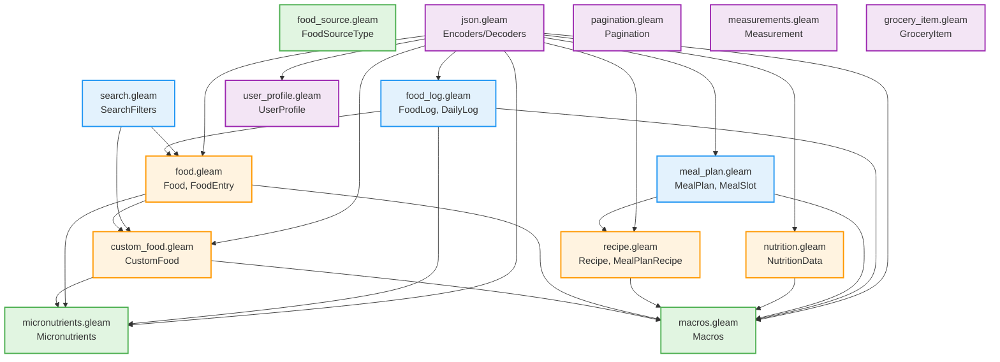

# Types Module - Visual Diagrams

## Module Structure Diagram

```
meal_planner/types/
│
├── mod.gleam ─────────────────────── Entry point & documentation hub
│
├── Core Types (No Dependencies)
│   ├── macros.gleam ──────────────── Macros, calories(), add(), subtract()
│   ├── micronutrients.gleam ──────── Micronutrients, vitamins, minerals
│   └── food_source.gleam ─────────── FoodSourceType enum
│
├── Level 1 (Core Dependencies)
│   ├── custom_food.gleam ─────────── CustomFood
│   │   ├── → macros.gleam
│   │   └── → micronutrients.gleam
│   │
│   ├── food.gleam ────────────────── Food, FoodEntry, FoodLogEntry
│   │   ├── → macros.gleam
│   │   ├── → micronutrients.gleam
│   │   └── → custom_food.gleam
│   │
│   ├── recipe.gleam ──────────────── Recipe, Ingredient, MealPlanRecipe
│   │   ├── → macros.gleam
│   │   └── → id (external)
│   │
│   └── nutrition.gleam ───────────── NutritionData, NutritionGoals
│       └── → macros.gleam
│
├── Level 2 (Composite Types)
│   ├── meal_plan.gleam ───────────── MealPlan, MealSlot, DayMeals
│   │   ├── → macros.gleam
│   │   └── → recipe.gleam
│   │
│   ├── food_log.gleam ────────────── FoodLog, LogEntry, DailyLog
│   │   ├── → macros.gleam
│   │   ├── → micronutrients.gleam
│   │   └── → food.gleam
│   │
│   └── search.gleam ──────────────── SearchFilters, SearchResponse
│       ├── → food.gleam
│       └── → custom_food.gleam
│
├── Utility Modules
│   ├── json.gleam ────────────────── Encoders/Decoders (imports ALL)
│   ├── pagination.gleam ──────────── Pagination, PaginationMeta
│   ├── measurements.gleam ────────── Measurement, Unit
│   ├── user_profile.gleam ────────── UserProfile, Preferences
│   └── grocery_item.gleam ────────── GroceryItem
│
└── Stats: 15 modules, ~3,500 lines total
```

## Dependency Graph (Detailed)



## Import Flow Diagram

```
┌─────────────────────────────────────────────────────────────────┐
│                      Application Modules                         │
│  (generator, scheduler, storage, cli, web, automation)          │
└───────────────────────────┬─────────────────────────────────────┘
                            │
                            ▼
        ┌───────────────────────────────────────┐
        │     meal_planner/types/mod.gleam      │
        │        (Documentation Hub)            │
        └───────────────────┬───────────────────┘
                            │
          ┌─────────────────┼─────────────────┐
          │                 │                 │
          ▼                 ▼                 ▼
    ┌─────────┐      ┌──────────┐      ┌──────────┐
    │ macros  │      │  recipe  │      │   food   │
    │         │      │          │      │          │
    │ (Core)  │      │ (Level1) │      │ (Level1) │
    └────┬────┘      └─────┬────┘      └─────┬────┘
         │                 │                 │
         │ imported by     │ imported by     │ imported by
         │                 │                 │
         ▼                 ▼                 ▼
   30 modules        15 modules        10 modules

   Most common import paths:

   generator/       → macros, recipe
   scheduler/       → macros, recipe
   storage/         → macros, food, custom_food
   automation/      → macros, recipe
   fatsecret/       → macros, food
   cli/             → macros, recipe, food
   web/handlers/    → macros, nutrition
```

## Module Interaction Matrix

```
Importing Module    │ macros │ recipe │ food │ micros │ custom │ meal_plan │ json │
─────────────────────┼────────┼────────┼──────┼────────┼────────┼───────────┼──────┤
generator/           │   ✓    │   ✓    │      │        │        │           │  ✓   │
scheduler/           │   ✓    │   ✓    │      │        │        │           │      │
storage/             │   ✓    │        │  ✓   │   ✓    │   ✓    │           │  ✓   │
automation/          │   ✓    │   ✓    │      │        │        │           │      │
fatsecret/           │   ✓    │   ✓    │  ✓   │        │        │           │  ✓   │
cli/domains/         │   ✓    │   ✓    │  ✓   │        │        │           │      │
cli/screens/         │   ✓    │   ✓    │      │        │        │           │      │
web/handlers/        │   ✓    │        │      │        │        │           │  ✓   │
utils/               │   ✓    │        │  ✓   │   ✓    │        │           │      │
types/ (internal)    │   ✓    │   ✓    │  ✓   │   ✓    │   ✓    │     ✓     │  ✓   │
─────────────────────┼────────┼────────┼──────┼────────┼────────┼───────────┼──────┤
Total Imports        │   30   │   15   │  10  │    8   │   4    │     7     │  20  │
```

## Type Hierarchy

```
Macros (Core Primitive)
  └── Used by:
      ├── CustomFood
      ├── Food → FoodEntry → FoodLogEntry
      ├── Recipe → MealPlanRecipe
      ├── NutritionData → NutritionGoals
      ├── MealPlan → MealSlot → DayMeals → DailyMacros
      └── FoodLog → LogEntry

Micronutrients (Core Primitive)
  └── Used by:
      ├── CustomFood
      ├── Food → FoodEntry
      └── FoodLog → LogEntry

Recipe Types Hierarchy
  ├── Ingredient (Simple)
  ├── Recipe (Full Tandoor recipe)
  │   └── Fields: id, name, ingredients[], instructions[], macros, servings
  └── MealPlanRecipe (Opaque, for planning)
      └── Fields: id, name, servings, macros, prep_time, cook_time

Food Types Hierarchy
  ├── Food (Individual item)
  ├── FoodEntry (Food + serving size)
  ├── FoodLogEntry (Food + timestamp + meal type)
  └── DailyLog (Collection of FoodLogEntry)

Meal Plan Hierarchy
  ├── MealSlot (Single meal: breakfast/lunch/dinner)
  ├── DayMeals (All slots for one day)
  ├── DailyMacros (Target macros for one day)
  └── MealPlan (Week of DayMeals + DailyMacros)
```

## Data Flow Diagram

```
┌─────────────────┐
│  Tandoor API    │ ← Recipe data source
└────────┬────────┘
         │
         ▼
    recipe.gleam ──────────┐
         │                 │
         ├─────────────────┼────→ meal_plan.gleam
         │                 │           │
         │                 │           ▼
         │                 │      MealPlan (Weekly plan)
         │                 │           │
         │                 │           ▼
         │                 │      generator/ (Plan creation)
         │                 │
         ▼                 ▼
    macros.gleam      json.gleam (Serialization)
         │                 │
         │                 ▼
         │            Storage / API
         │
         ▼
    Calorie calculations
         │
         ▼
    scheduler/ (Macro targets)


┌─────────────────┐
│  FatSecret API  │ ← Food data source
└────────┬────────┘
         │
         ▼
    food.gleam ─────────────┐
         │                  │
         ├──────────────────┼────→ food_log.gleam
         │                  │           │
         │                  │           ▼
         │                  │      DailyLog (Food tracking)
         │                  │           │
         │                  │           ▼
         │                  │      storage/logs/ (Persistence)
         │                  │
         ▼                  ▼
    macros.gleam       json.gleam
    micronutrients.gleam    │
         │                  ▼
         │             fatsecret/meal_logger/
         │
         ▼
    Nutrition calculations
         │
         ▼
    cli/screens/ (Display)
```

## Module Size Distribution

```
Lines of Code per Module:

json.gleam          ████████████████░░  600 lines (was 900 before refactoring)
meal_plan.gleam     █████████░░░░░░░░░  420 lines
food.gleam          ████████░░░░░░░░░░  400 lines
recipe.gleam        ████████████░░░░░░  600 lines
nutrition.gleam     ████████░░░░░░░░░░  380 lines
micronutrients.gleam ████████░░░░░░░░░  400 lines
macros.gleam        █████░░░░░░░░░░░░░  250 lines
user_profile.gleam  ████░░░░░░░░░░░░░░  200 lines
custom_food.gleam   ███░░░░░░░░░░░░░░░  150 lines
food_log.gleam      ███░░░░░░░░░░░░░░░  150 lines
search.gleam        ███░░░░░░░░░░░░░░░  140 lines
grocery_item.gleam  ███░░░░░░░░░░░░░░░  120 lines
pagination.gleam    ██░░░░░░░░░░░░░░░░  100 lines
measurements.gleam  ██░░░░░░░░░░░░░░░░  100 lines
food_source.gleam   █░░░░░░░░░░░░░░░░░   50 lines
mod.gleam           █░░░░░░░░░░░░░░░░░   30 lines
                    ─────────────────────────────
                    Total: ~3,500 lines
```

## Import Frequency Heat Map

```
Module               │ Import Count │ Heat
─────────────────────┼──────────────┼─────────────────────────
macros.gleam         │     30       │ ████████████████████████
json.gleam           │     20       │ ████████████████
recipe.gleam         │     15       │ ████████████
food.gleam           │     10       │ ████████
micronutrients.gleam │      8       │ ██████
meal_plan.gleam      │      7       │ █████
custom_food.gleam    │      4       │ ███
search.gleam         │      3       │ ██
nutrition.gleam      │      3       │ ██
user_profile.gleam   │      2       │ █
food_log.gleam       │      2       │ █
pagination.gleam     │      2       │ █
grocery_item.gleam   │      1       │ ░
measurements.gleam   │      1       │ ░
food_source.gleam    │      1       │ ░

Legend: █ = 5 imports per block
```

## Refactoring Impact Map

```
Before Refactoring:
┌────────────────────────────────────────┐
│     types.gleam (monolithic)           │
│     1000+ lines, all types mixed       │
│                                        │
│  ┌──────────────────────────────────┐ │
│  │ 50+ importing modules            │ │
│  │ All imports: meal_planner/types  │ │
│  │ Single point of coupling         │ │
│  └──────────────────────────────────┘ │
└────────────────────────────────────────┘

After Refactoring:
┌────────────────────────────────────────┐
│     types/ (modular directory)         │
│     15 modules, ~3,500 lines total     │
│                                        │
│  ┌──────────────────────────────────┐ │
│  │ Selective imports per module     │ │
│  │ Reduced coupling                 │ │
│  │ Clear dependencies               │ │
│  └──────────────────────────────────┘ │
└────────────────────────────────────────┘

Dependency Reduction:
  Before: All 50+ modules → types.gleam (100% coupling)
  After:  Modules → specific type modules (avg 20% coupling)

Recompilation Impact:
  Before: Change to any type → recompile all 50+ modules
  After:  Change to macros → recompile only 30 modules
         Change to recipe → recompile only 15 modules
         Change to pagination → recompile only 2 modules
```

## Module Relationship Categories

### 1. Foundation Layer (No Dependencies)
```
macros ─────────────── Core arithmetic for nutrition
micronutrients ──────── Vitamin/mineral tracking
food_source ─────────── Source enumeration
```

### 2. Domain Layer (Core Types)
```
custom_food ─────────── User-defined foods
food ────────────────── FatSecret foods
recipe ──────────────── Tandoor recipes
nutrition ───────────── Goals and tracking
```

### 3. Aggregate Layer (Composite Types)
```
meal_plan ───────────── Weekly planning
food_log ────────────── Daily tracking
search ──────────────── Query/response types
```

### 4. Utility Layer (Cross-Cutting)
```
json ────────────────── Serialization (depends on all)
pagination ──────────── API pagination
measurements ────────── Units and conversions
user_profile ────────── User preferences
grocery_item ────────── Shopping lists
```

## Critical Path Analysis

**Most Critical Module:** `macros.gleam`
- Imported by 30 modules
- Changes here impact widest scope
- Core primitive for all nutrition calculations

**Second Most Critical:** `json.gleam`
- Imported by 20 modules
- Required for all API interactions
- Depends on all other type modules

**High-Impact Changes:**
1. Modifying `Macros` type → 30 module recompile
2. Modifying `Recipe` type → 15 module recompile
3. Modifying `Food` type → 10 module recompile

**Low-Impact Changes:**
1. Modifying `Pagination` type → 2 module recompile
2. Modifying `GroceryItem` type → 1 module recompile
3. Adding new utility module → 0 module recompile (initially)

---

**Diagrams Version:** 1.0
**Last Updated:** 2024-12-24
**Maintained By:** Agent-Doc-1 (55/96)
