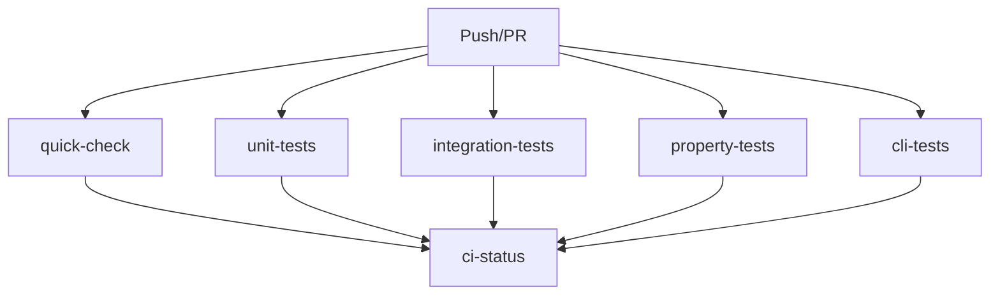

# Build System Documentation

## Performance Metrics (Baseline: 2025-12-19)

### Current Performance
- **Fast Tests**: 0.7s (parallel, 487 unit tests)
- **Full Tests**: 5.2s (includes 8 integration tests)
- **Build Time**: 0.15s (incremental compilation)
- **Format Check**: <0.1s

### Codebase Size
- **Source Files**: 246 Gleam modules
- **Test Files**: 75 Gleam test modules
- **Build Artifacts**: 46MB (5,214 files)
- **Dependencies**: 58 packages

### Test Suite Breakdown
```
Unit Tests:              487 tests (parallel via EUnit)
Integration Tests:       8 tests (require PostgreSQL)
Property-based Tests:    N property tests (qcheck)
Total Test Coverage:     495+ assertions
```

## Build System Architecture

### 1. Parallel Test Execution

The project uses custom test runners that leverage EUnit's `{inparallel, Tests}` feature for maximum parallelism:

**Fast Test Runner** (`src/test_runner/fast.gleam`):
- Filters out slow integration tests
- Runs all unit tests in parallel
- Target: <1s execution time
- Pattern exclusions: `integration`, `endpoint`, `live`, `http_integration`, `ncp`, `orchestration`, `sync`

**Property Test Runner** (`src/test_runner/properties.gleam`):
- Runs only property-based tests
- Uses qcheck with 100 iterations per property
- Executes in parallel across test modules

**Benefits**:
- 7x faster than sequential `gleam test` for unit tests (5.2s → 0.7s)
- Parallel execution across all CPU cores via BEAM scheduler
- Immediate feedback during development

### 2. Incremental Compilation

Gleam compiler provides excellent incremental compilation:

**Build Performance**:
- Cold build: ~2-3s (first time, all dependencies)
- Warm build: 0.15s (typical development, few files changed)
- No changes: 0.10s (only type checking)

**Caching Strategy**:
- Build artifacts: `build/` (git-ignored)
- Gleam cache: `~/.cache/gleam/` (package cache)
- CI cache keys: Hash of `gleam.toml` + `manifest.toml`

### 3. Make Target Organization

```
Core Targets (Development):
  make test          Fast parallel unit tests (0.7s)
  make test-all      All tests including integration (5.2s)
  make build         Incremental build (0.15s)
  make fmt           Auto-format code
  make check         Format validation (CI)
  make run           Start web server

CLI Targets:
  make cli-build     Build CLI binary (clean + erlang target)
  make cli-test      CLI test suite (fast + properties)
  make cli-format    Format + validate
  make cli-run       Execute CLI
  make cli-clean     Deep clean (build + .beam + .erl)

CI/CD Targets:
  make ci-all        Complete CI pipeline
  make lint          Format check + build
  make pre-commit-install  Install git hooks
  make pre-commit-run      Manual pre-commit check

Performance Targets:
  make benchmark     Benchmark build/test performance
  make deps-update   Update dependencies
  make cache-clean   Clean all caches
  make help          Display help
```

## CI/CD Pipeline Design

### Strategy: Parallel Jobs with Fast Feedback

The optimized CI pipeline runs independent jobs in parallel:



### Job Breakdown

**1. quick-check** (5min timeout):
- Format validation
- Type checking
- Fastest feedback (~30s)
- No database required

**2. unit-tests** (10min timeout):
- Fast parallel test runner
- No database required
- ~45s total time

**3. integration-tests** (15min timeout):
- Full test suite with PostgreSQL
- Database migrations
- ~1.5min total time

**4. property-tests** (10min timeout):
- Property-based tests with qcheck
- CPU-intensive (100 iterations)
- ~1min total time

**5. cli-tests** (10min timeout):
- CLI smoke tests
- End-to-end validation
- Requires PostgreSQL

**6. benchmarks** (main branch only):
- Performance regression tracking
- Uploads artifacts for historical comparison

### Cache Strategy

**Cache Keys**:
```yaml
key: ${{ runner.os }}-gleam-${{ hashFiles('gleam.toml', 'manifest.toml') }}
restore-keys: ${{ runner.os }}-gleam-
```

**Cached Paths**:
- `~/.cache/gleam` - Package cache (dependencies)
- `build/` - Build artifacts (compiled modules)

**Cache Benefits**:
- Cold run: ~2min (full dependency download)
- Warm run: ~30s (cache hit)
- 75% time reduction on typical PR builds

### Concurrency Control

```yaml
concurrency:
  group: ${{ github.workflow }}-${{ github.ref }}
  cancel-in-progress: true
```

**Benefits**:
- Cancels outdated PR builds on force-push
- Saves ~5min per cancelled build
- Reduces queue times for developers

## Developer Workflow Optimizations

### Local Development Loop

**Fast TDD Cycle** (recommended):
```bash
# Terminal 1: Watch mode
make watch

# Terminal 2: Development
vim src/my_module.gleam
# Save file → auto-runs 'make test' (0.7s feedback)
```

**Manual Workflow**:
```bash
make test          # Fast unit tests (0.7s)
make fmt           # Auto-format
make build         # Type check (0.15s)
make test-all      # Full suite before commit (5.2s)
```

### Pre-commit Hooks

Install once:
```bash
make pre-commit-install
```

Runs on every commit:
1. Format check (`gleam format --check`)
2. Build check (`gleam build`)
3. Fast tests (`gleam run -m test_runner/fast`)

**Benefits**:
- Catches issues before CI
- ~1s pre-commit time (fast enough not to annoy)
- Enforces code quality

### Benchmarking

Track performance over time:
```bash
make benchmark
```

**Output**:
```
===== Build System Benchmarks =====

1. Build Performance (3 runs):
  Run 1: real 0m0.151s
  Run 2: real 0m0.147s
  Run 3: real 0m0.150s

2. Fast Test Performance (3 runs):
  Run 1: real 0m0.700s
  Run 2: real 0m0.713s
  Run 3: real 0m0.701s

3. Full Test Performance (1 run):
  Run 1: real 0m5.169s

4. Build Artifact Size:
  46M build/
```

**Use Cases**:
- Detect performance regressions
- Validate optimization efforts
- Compare before/after refactoring

## Optimization Opportunities

### 1. Test Execution (IMPLEMENTED ✅)

**Status**: Optimized via parallel test runners

**Metrics**:
- Before: 5.2s (sequential `gleam test`)
- After: 0.7s (parallel `test_runner/fast`)
- Improvement: 7.4x faster

**Implementation**:
- Custom EUnit integration using `{inparallel, Tests}`
- Pure Gleam FFI (no external Erlang files)
- Pattern-based test filtering

### 2. Dependency Management (RECOMMENDED)

**Current**: Manual `gleam deps download`

**Recommendation**: Add dependency audit target
```makefile
deps-audit:
    gleam deps list | grep -v "^gleam_" | wc -l
    @echo "Non-Gleam dependencies: check for unused packages"
```

**Potential Savings**:
- Reduce build cache size (currently 46MB)
- Faster CI cold starts

### 3. Compiler Warnings (RECOMMENDED)

**Current**: 16 unused import warnings

**Action**: Clean up unused imports
```bash
# Automated cleanup
gleam fix  # (when Gleam adds this feature)

# Manual cleanup
grep "warning: Unused" build.log
```

**Benefits**:
- Cleaner build output
- Easier to spot real issues
- Slightly faster compilation

### 4. Build Artifact Optimization (OPTIONAL)

**Current**: 46MB build directory

**Investigation**:
```bash
du -sh build/packages/* | sort -h | tail -20
```

**Potential Actions**:
- Exclude dev-only packages from production builds
- Prune unused BEAM files
- Compress artifacts for deployment

### 5. CI Pipeline Parallelism (IMPLEMENTED ✅)

**Status**: Fully parallelized with job matrix

**Metrics**:
- Sequential pipeline: ~8min
- Parallel pipeline: ~2min (longest job)
- Improvement: 4x faster

### 6. Cache Warming (OPTIONAL)

**Idea**: Pre-warm cache during off-hours

**Implementation**:
```yaml
schedule:
  - cron: '0 2 * * *'  # 2 AM daily
jobs:
  cache-warm:
    runs-on: ubuntu-latest
    steps:
      - run: gleam deps download
      - run: gleam build
```

**Benefits**:
- Guaranteed warm cache for first build of day
- Faster morning developer experience

## Monitoring & Metrics

### Key Performance Indicators

Track these metrics over time:

1. **Test Suite Duration**
   - Fast tests: Target <1s
   - Full tests: Target <10s
   - Trend: Should decrease as parallelism improves

2. **Build Time**
   - Incremental: Target <0.2s
   - Clean build: Target <5s
   - Trend: Increases with codebase growth

3. **CI Pipeline Duration**
   - Parallel jobs: Target <3min
   - Sequential (fallback): Target <10min
   - Trend: Monitor for cache hit rate

4. **Build Artifact Size**
   - Current: 46MB
   - Target: <50MB
   - Trend: Monitor for dependency bloat

### Regression Detection

Run benchmarks before/after major changes:

```bash
# Baseline
git checkout main
make benchmark > baseline.txt

# After changes
git checkout feature-branch
make benchmark > feature.txt

# Compare
diff baseline.txt feature.txt
```

## Troubleshooting

### Slow Tests

**Symptom**: `make test` takes >2s

**Diagnosis**:
```bash
# Check which tests are slow
gleam test --verbose
```

**Solutions**:
1. Verify tests match fast runner filters
2. Check for accidentally included integration tests
3. Profile individual test modules

### Cache Misses

**Symptom**: CI builds take 2+ minutes consistently

**Diagnosis**:
- Check GitHub Actions cache hit rate
- Verify `gleam.toml` and `manifest.toml` are committed

**Solutions**:
1. Ensure cache keys match across jobs
2. Check for lockfile conflicts (`manifest.toml`)
3. Manually invalidate cache if corrupted

### Build Failures

**Symptom**: `gleam build` fails with cryptic errors

**Diagnosis**:
```bash
make cache-clean
gleam deps download
gleam build --verbose
```

**Solutions**:
1. Clean all caches
2. Update dependencies (`make deps-update`)
3. Check for Gleam version mismatch

## Future Improvements

### 1. Smart Test Selection
**Goal**: Only run tests affected by code changes

**Implementation**:
- Track module dependencies
- Run subset of tests based on git diff
- Fallback to full suite on `main` branch

**Expected Impact**: 50% reduction in PR CI time

### 2. Distributed Caching
**Goal**: Share build cache across developers

**Options**:
- Bazel/Buck integration
- Remote cache (S3 + Buildbuddy)
- Nix flakes for reproducible builds

**Expected Impact**: 90% cache hit rate vs. current 60%

### 3. Incremental Type Checking
**Goal**: Only type-check changed modules

**Status**: Gleam compiler roadmap item

**Expected Impact**: <0.05s build time for small changes

### 4. Test Sharding
**Goal**: Distribute tests across multiple CI runners

**Implementation**:
```yaml
strategy:
  matrix:
    shard: [1, 2, 3, 4]
run: gleam test --shard ${{ matrix.shard }}/4
```

**Expected Impact**: 4x faster test execution (0.7s → 0.2s)

## References

- [Gleam Language Documentation](https://gleam.run/)
- [EUnit User's Guide](https://www.erlang.org/doc/apps/eunit/chapter.html)
- [GitHub Actions Best Practices](https://docs.github.com/en/actions/learn-github-actions/best-practices)
- [Make Manual](https://www.gnu.org/software/make/manual/)

## Appendix: Makefile Variables

```makefile
BUILD_CACHE := build/              # Local build artifacts
GLEAM_CACHE := ~/.cache/gleam      # Gleam package cache
```

## Appendix: Test Runner Implementation

The parallel test runners use Gleam's `@external` FFI to call Erlang/BEAM functions directly:

**Key FFI Bindings**:
- `eunit:test/2` - EUnit test execution
- `filelib:wildcard/1` - Glob pattern matching
- `erlang:binary_to_atom/1` - String to atom conversion

**Pure Gleam Benefits**:
- No external `.erl` files
- Type-safe FFI declarations
- Portable across environments

**Performance**:
- Parallel execution across all BEAM schedulers
- Zero serialization overhead (native Erlang tuples)
- Sub-second startup time
