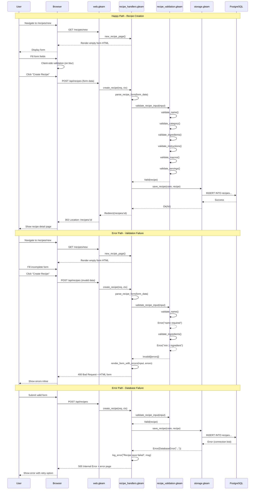
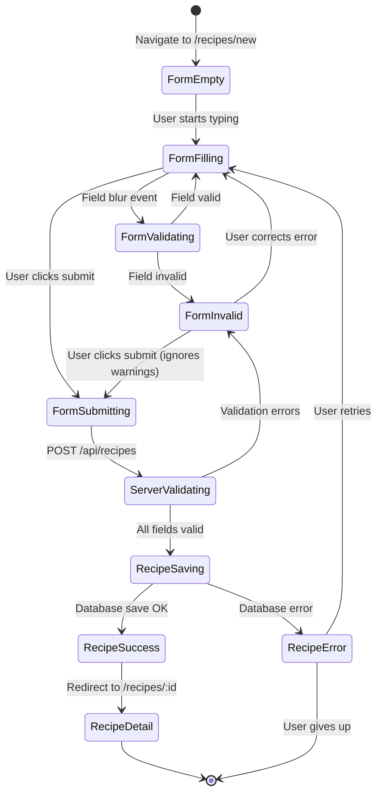
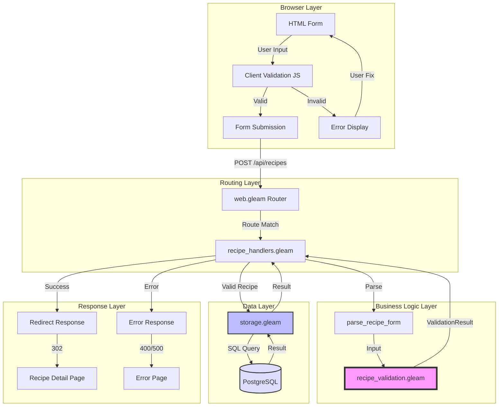
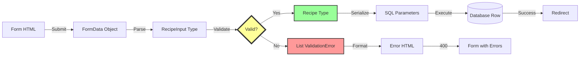
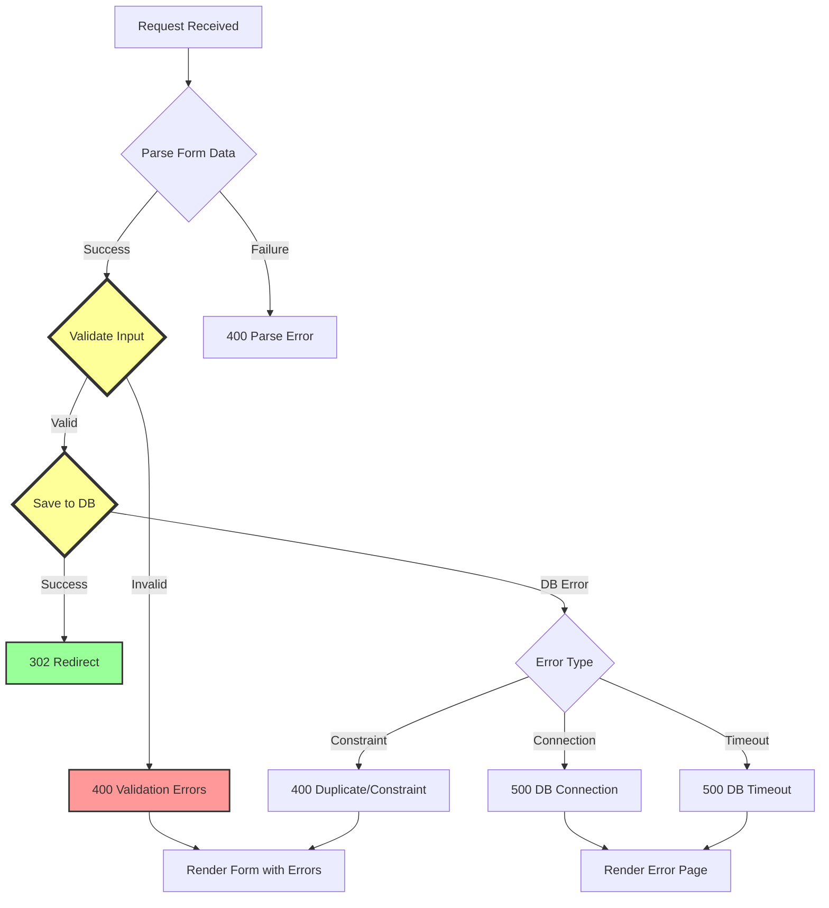
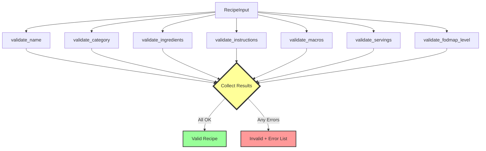
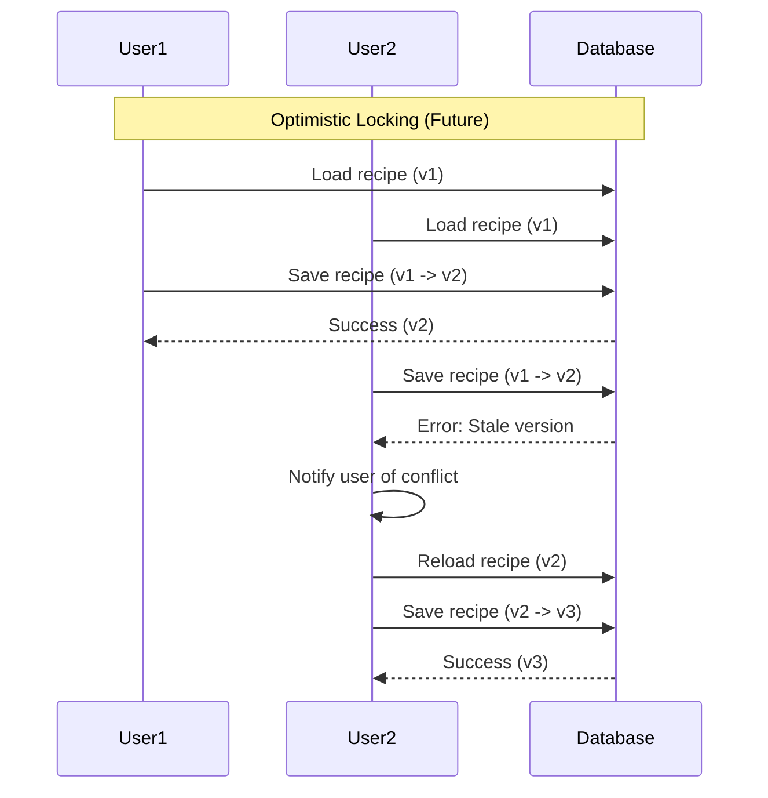
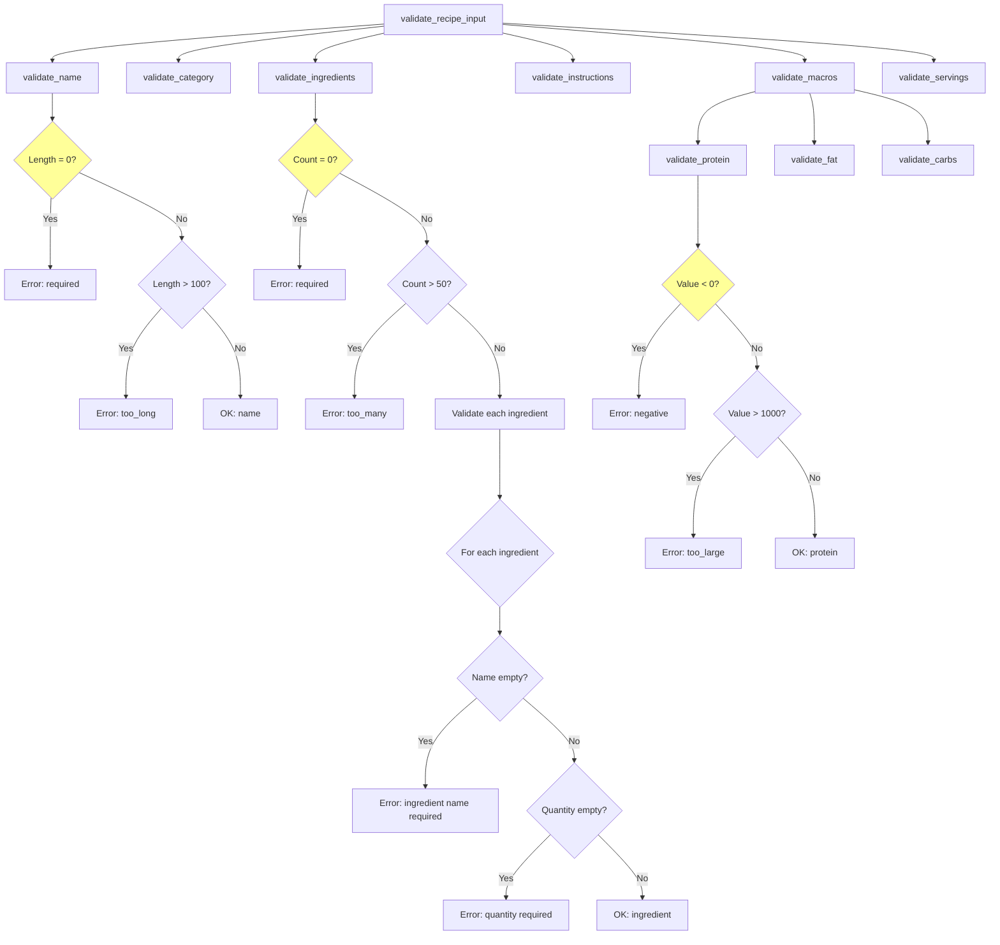

# Recipe Form Data Flow Diagram

## Detailed Sequence Diagram



## State Transition Diagram



## Component Interaction Diagram



## Data Transformation Flow



## Key Data Structures

### 1. Form Data (HTTP POST)

```
Content-Type: application/x-www-form-urlencoded

name=Grilled+Chicken&
category=chicken&
ingredients[0][name]=Chicken+breast&
ingredients[0][quantity]=8+oz&
ingredients[1][name]=Rice&
ingredients[1][quantity]=1+cup&
instructions[0]=Cook+rice&
instructions[1]=Grill+chicken&
protein=45.0&
fat=12.0&
carbs=55.0&
servings=2&
fodmap_level=low&
vertical_compliant=true
```

### 2. RecipeInput Type (Parsed)

```gleam
RecipeInput(
  name: "Grilled Chicken",
  category: "chicken",
  ingredients: [
    IngredientInput("Chicken breast", "8 oz"),
    IngredientInput("Rice", "1 cup"),
  ],
  instructions: [
    "Cook rice",
    "Grill chicken",
  ],
  protein: 45.0,
  fat: 12.0,
  carbs: 55.0,
  servings: 2,
  fodmap_level: "low",
  vertical_compliant: True,
)
```

### 3. Recipe Type (Validated)

```gleam
Recipe(
  id: "uuid-generated",
  name: "Grilled Chicken",
  ingredients: [
    Ingredient("Chicken breast", "8 oz"),
    Ingredient("Rice", "1 cup"),
  ],
  instructions: ["Cook rice", "Grill chicken"],
  macros: Macros(protein: 45.0, fat: 12.0, carbs: 55.0),
  servings: 2,
  category: "chicken",
  fodmap_level: Low,
  vertical_compliant: True,
)
```

### 4. Database Row (Serialized)

```sql
INSERT INTO recipes VALUES (
  'uuid-generated',                              -- id
  'Grilled Chicken',                             -- name
  'Chicken breast:8 oz|Rice:1 cup',              -- ingredients
  'Cook rice|Grill chicken',                     -- instructions
  45.0,                                          -- protein
  12.0,                                          -- fat
  55.0,                                          -- carbs
  2,                                             -- servings
  'chicken',                                     -- category
  'low',                                         -- fodmap_level
  true                                           -- vertical_compliant
);
```

## Error Handling Flow



## Validation Pipeline



## Concurrency & Locking

Since this is a single-user application (MVP), we don't need complex locking. However, for future multi-user scenarios:



**Implementation**:
- Add `version` column to recipes table
- Increment on every update
- Check version matches before UPDATE
- Return error if version mismatch

---

## Detailed Validation Rules Flow



---

This data flow documentation provides a comprehensive view of how data moves through the recipe creation system, from user input to database persistence, including all validation and error handling paths.
