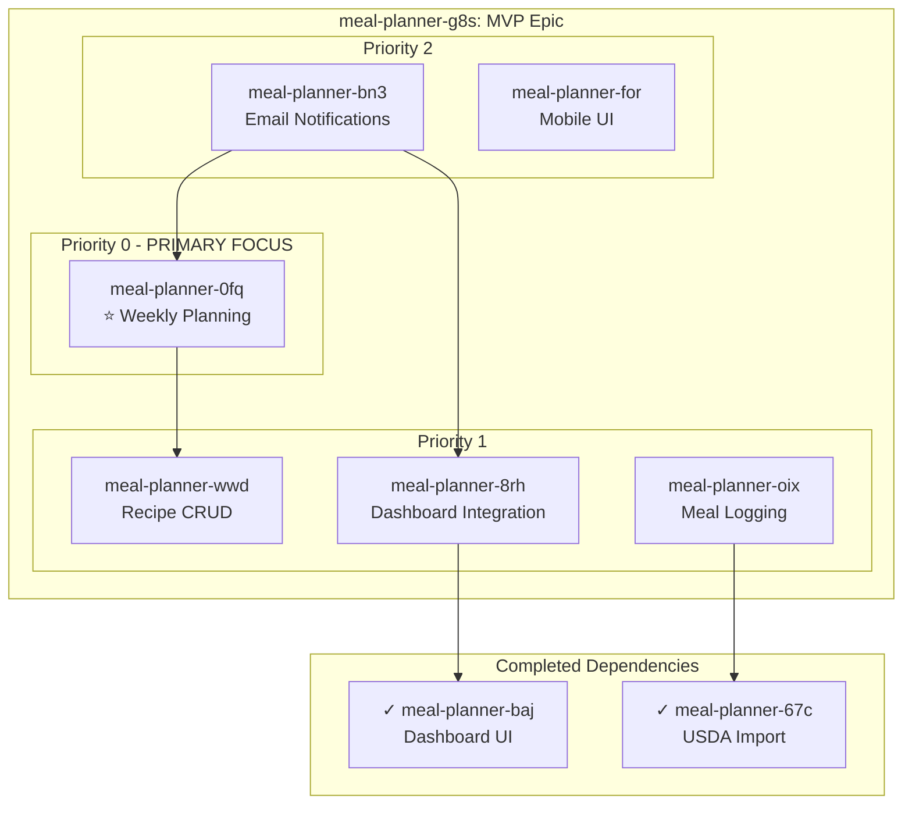

# Epic: Meal Planner Web Application MVP

## Bead ID: meal-planner-g8s

## Epic Description
Complete web application with meal logging, recipe management, **weekly meal planning** (PRIMARY FOCUS), email notifications, and mobile-responsive UI.

## Children Features

### P0 - Critical Priority (PRIMARY FOCUS)
| Bead ID | Feature | Spec File | Dependencies |
|---------|---------|-----------|--------------|
| meal-planner-0fq | **Weekly Meal Planning** | `weekly-meal-planning.spec.md` | meal-planner-wwd |

### P1 - High Priority
| Bead ID | Feature | Spec File | Dependencies |
|---------|---------|-----------|--------------|
| meal-planner-wwd | Recipe Management CRUD | `recipe-management-crud.spec.md` | - |
| meal-planner-8rh | Live Dashboard Integration | `live-dashboard-integration.spec.md` | meal-planner-baj |
| meal-planner-oix | Meal Logging System | `meal-logging-system.spec.md` | meal-planner-67c |

### P2 - Medium Priority
| Bead ID | Feature | Spec File | Dependencies |
|---------|---------|-----------|--------------|
| meal-planner-bn3 | Email Notifications | `email-notifications.spec.md` | meal-planner-0fq, meal-planner-8rh |
| meal-planner-for | Mobile-Responsive UI | `mobile-responsive-ui.spec.md` | - |

## Dependency Graph



## Implementation Order

Based on dependencies and priorities, the recommended implementation order is:

1. **Phase 1 - Foundation for Weekly Planning** (PRIORITY 0)
   - meal-planner-wwd: Recipe CRUD (required for weekly planning)

2. **Phase 2 - PRIMARY FEATURE** (PRIORITY 0)
   - meal-planner-0fq: ⭐ **Weekly Meal Planning** (blocked by wwd)

3. **Phase 3 - Core Features** (PRIORITY 1)
   - meal-planner-8rh: Dashboard Integration (blocked by baj ✓)
   - meal-planner-oix: Meal Logging (blocked by 67c ✓)
   - meal-planner-for: Mobile-Responsive UI

4. **Phase 4 - Notifications** (PRIORITY 2)
   - meal-planner-bn3: Email Notifications (blocked by 0fq, 8rh)

## Acceptance Criteria
- [ ] ⭐ **Weekly meal planning feature fully functional** (PRIMARY)
- [ ] Recipe CRUD supports weekly planning workflow
- [ ] Dashboard integration shows weekly nutrition summaries
- [ ] Meal logging tracks adherence to weekly plans
- [ ] Mobile-responsive on all viewports
- [ ] Performance: Lighthouse score 90+ on mobile

## Progress Tracking
Use `bd epic status` to track completion:
```
○ meal-planner-g8s Meal Planner Web Application MVP
   Progress: 0/6 children closed (0%)
   Priority 0: Weekly Planning → Recipe CRUD
```

## Notes
- **User authentication removed** from MVP scope (deferred to post-MVP)
- **Weekly meal planning** is the PRIMARY FOCUS feature
- All other features support or enhance the weekly planning workflow
