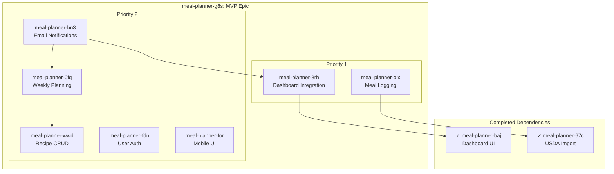

# Epic: Meal Planner Web Application MVP

## Bead ID: meal-planner-g8s

## Epic Description
Complete web application with meal logging, recipe management, weekly planning, email notifications, user authentication, and mobile-responsive UI.

## Children Features

### P1 - High Priority
| Bead ID | Feature | Spec File | Dependencies |
|---------|---------|-----------|--------------|
| meal-planner-8rh | Live Dashboard Integration | `live-dashboard-integration.spec.md` | meal-planner-baj |
| meal-planner-oix | Meal Logging System | `meal-logging-system.spec.md` | meal-planner-67c |

### P2 - Medium Priority
| Bead ID | Feature | Spec File | Dependencies |
|---------|---------|-----------|--------------|
| meal-planner-wwd | Recipe Management CRUD | `recipe-management-crud.spec.md` | - |
| meal-planner-0fq | Weekly Meal Planning | `weekly-meal-planning.spec.md` | meal-planner-wwd |
| meal-planner-bn3 | Email Notifications | `email-notifications.spec.md` | meal-planner-0fq, meal-planner-8rh |
| meal-planner-fdn | User Authentication | `user-authentication.spec.md` | - |
| meal-planner-for | Mobile-Responsive UI | `mobile-responsive-ui.spec.md` | - |

## Dependency Graph



## Implementation Order

Based on dependencies, the recommended implementation order is:

1. **Phase 1 - Foundation** (No blockers)
   - meal-planner-wwd: Recipe CRUD
   - meal-planner-fdn: User Authentication
   - meal-planner-for: Mobile-Responsive UI

2. **Phase 2 - Core Features** (Depends on completed work)
   - meal-planner-8rh: Dashboard Integration (blocked by baj ✓)
   - meal-planner-oix: Meal Logging (blocked by 67c ✓)

3. **Phase 3 - Planning**
   - meal-planner-0fq: Weekly Meal Planning (blocked by wwd)

4. **Phase 4 - Notifications**
   - meal-planner-bn3: Email Notifications (blocked by 0fq, 8rh)

## Acceptance Criteria
- [ ] All 7 child features pass acceptance criteria
- [ ] End-to-end user flow works: login → log meals → view dashboard → plan week → receive emails
- [ ] Mobile-responsive on all viewports
- [ ] Performance: Lighthouse score 90+ on mobile

## Progress Tracking
Use `bd epic status` to track completion:
```
○ meal-planner-g8s Meal Planner Web Application MVP
   Progress: 0/7 children closed (0%)
```
